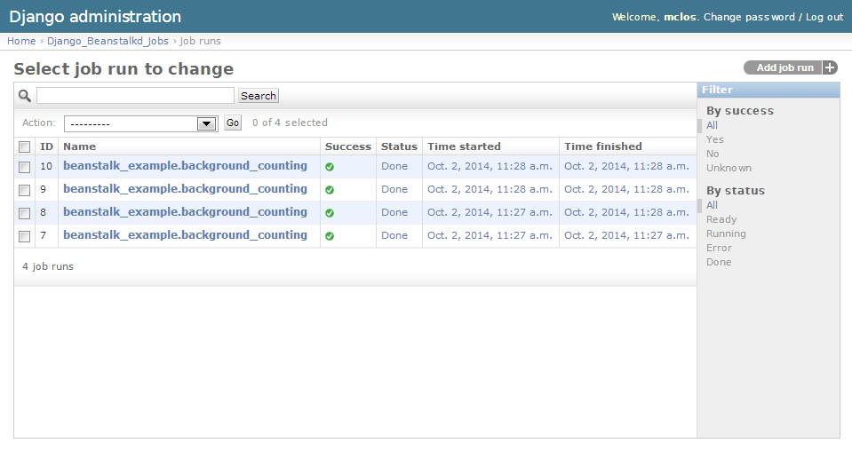
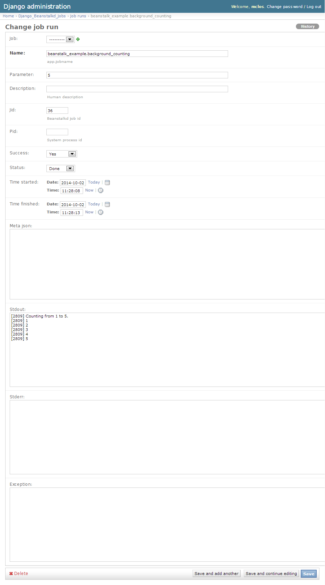

django-beanstalkd-jobs
======================

*django-beanstalkd-jobs* is a jobs system inspired by features of Redis Queue. It is based on [beanstalkd][beanstalkd] and uses the [Python Bindings][beanstalkc].

*django-beanstalkd-jobs* is a spin-off of [django-beanstalkd][django-beanstalkd], adding logged execution of jobs into the django configured database.

Features
========

Create jobs as simple functions that accept a single string parameter:

```python
"""
Example Beanstalk Job File.
Needs to be called beanstalk_jobs.py and reside inside a registered Django app.
"""
import os
import time

from django_beanstalkd_jobs import beanstalk_job


@beanstalk_job
def background_counting(arg):
    """
    Do some incredibly useful counting to the value of arg
    """
    value = int(arg)
    pid = os.getpid()
    print "[%s] Counting from 1 to %d." % (pid, value)
    for i in range(1, value+1):
        print '[%s] %d' % (pid, i)
        time.sleep(1)
```

Execute them with a worker, in the background
```sh
python manage.py beanstalk_worker
```

Or with multiple workers
```sh
python manage.py beanstalk_worker -w 4
```

For the `beanstalk_example` app, the command output will look like this

```
Available jobs:
* beanstalk_example.background_counting
```

Everything is now ready and you can call the job function

```python
from django_beanstalkd_jobs import BeanstalkClient
client = BeanstalkClient()
client.call('beanstalk_example.background_counting', '5')
```

The call will return immediately, and the job function will be executed by the worker(s)

If checking the `beanstalk_example` app, you can run the client with
```
python manage.py beanstalk_example_client
```

The output looks like this
```
Asynchronous Beanstalk Call
-------------------------
Notice how this app exits, while the workers still work on the tasks.
```

Check the admin for job execution results


And the detail view to see the captured stdout, stderr, exception if any was raised, etc.


Set meta information in the job for extended information


Acknowledgements
================

This application is based in large part on Jonas & der Wolf's [django-beanstalkd][django-beanstalkd] which in turn is based in large part on Fred Wenzel's [django-gearman][django-gearman].
If you're looking for synchronous execution of jobs, check out [Gearman][gearman]
and Fred's library! Beanstalkd is useful for background processes only.

[django-beanstalkd]: http://github.com/jonasvp/django-beanstalkd/
[beanstalkd]: http://kr.github.com/beanstalkd/
[beanstalkc]: http://github.com/earl/beanstalkc/
[django-gearman]: http://github.com/fwenzel/django-gearman
[gearman]: http://gearman.org/

Installation
------------
It's the same for both the client and worker instances of your django project:

    pip install -e git+https://github.com/manelclos/django-beanstalkd-jobs.git#egg=django-beanstalkd-jobs

Add ``django_beanstalkd_jobs`` to the `INSTALLED_APPS` section of `settings.py`.

Specify the following settings in your local settings.py file if your beanstalkd
server isn't accessible on port 11300 of localhost (127.0.0.1):

    # My beanstalkd server
    BEANSTALK_SERVER = '127.0.0.1:11300'  # the default value

If necessary, you can specify a pattern to be applied to your beanstalk worker
functions:

    # beanstalk job name pattern. Namespacing etc goes here. This is the pattern
    # your jobs will register as with the server, and that you'll need to use
    # when calling them from a non-django-beanstalkd client.
    # replacement patterns are:
    # %(app)s : django app name the job is filed under
    # %(job)s : job name
    BEANSTALK_JOB_NAME = '%(app)s.%(job)s'


Workers
-------
### Registering jobs
Create a file `beanstalk_jobs.py` in any of your django apps, and define as many
jobs as functions as you like. The job must accept a single string argument as
passed by the caller.

Mark each of these functions as beanstalk jobs by decorating them with
`django_beanstalkd_jobs.beanstalk_job`.

For an example, look at the `beanstalk_example` app's `benstalk_jobs.py` file.

### Starting a worker
To start a worker, run `python manage.py beanstalk_worker`. It will start
serving all registered jobs.

To spawn more than one worker (if, e.g., most of your jobs are I/O bound),
use the `-w` option:

    python manage.py beanstalk_worker -w 5

will start five workers.

Since the process will keep running while waiting for and executing jobs,
you probably want to run this in a _screen_ session or similar.

Clients
-------
To make your workers work, you need a client app passing data to them. Create
and instance of the `django_beanstalkd_jobs.BeanstalkClient` class and `call` a
function with it:

    from django_beanstalkd_jobs import BeanstalkClient
    client = BeanstalkClient()
    client.call('beanstalk_example.background_counting', '5')

For a live example look at the `beanstalk_example` app, in the
`management/commands/beanstalk_example_client.py` file. Arguments to `call` are

    priority: an integer number that specifies the priority. Jobs with a
              smaller priority get executed first
    delay:    how many seconds to wait before the job can be reserved
    ttr:      how many seconds a worker has to process the job before it gets requeued


Example App
-----------
For a full, working, example application, add `beanstalk_example` to your
`INSTALLED_APPS`, then run a worker in one shell:

    python manage.py beanstalk_worker -w 4

and execute the example app in another:

    python manage.py beanstalk_example_client

You can see the client sending data and the worker(s) working on it.

Licensing
---------
This software is licensed under the [Mozilla Tri-License][MPL]:

    ***** BEGIN LICENSE BLOCK *****
    Version: MPL 1.1/GPL 2.0/LGPL 2.1

    The contents of this file are subject to the Mozilla Public License Version
    1.1 (the "License"); you may not use this file except in compliance with
    the License. You may obtain a copy of the License at
    http://www.mozilla.org/MPL/

    Software distributed under the License is distributed on an "AS IS" basis,
    WITHOUT WARRANTY OF ANY KIND, either express or implied. See the License
    for the specific language governing rights and limitations under the
    License.

    The Original Code is django-gearman.

    The Initial Developer of the Original Code is Mozilla.
    Portions created by the Initial Developer are Copyright (C) 2010
    the Initial Developer. All Rights Reserved.

    Contributor(s):
      Jonas VP <jvp@jonasundderwolf.de>
      Frederic Wenzel <fwenzel@mozilla.com>

    Alternatively, the contents of this file may be used under the terms of
    either the GNU General Public License Version 2 or later (the "GPL"), or
    the GNU Lesser General Public License Version 2.1 or later (the "LGPL"),
    in which case the provisions of the GPL or the LGPL are applicable instead
    of those above. If you wish to allow use of your version of this file only
    under the terms of either the GPL or the LGPL, and not to allow others to
    use your version of this file under the terms of the MPL, indicate your
    decision by deleting the provisions above and replace them with the notice
    and other provisions required by the GPL or the LGPL. If you do not delete
    the provisions above, a recipient may use your version of this file under
    the terms of any one of the MPL, the GPL or the LGPL.

    ***** END LICENSE BLOCK *****

[MPL]: http://www.mozilla.org/MPL/
